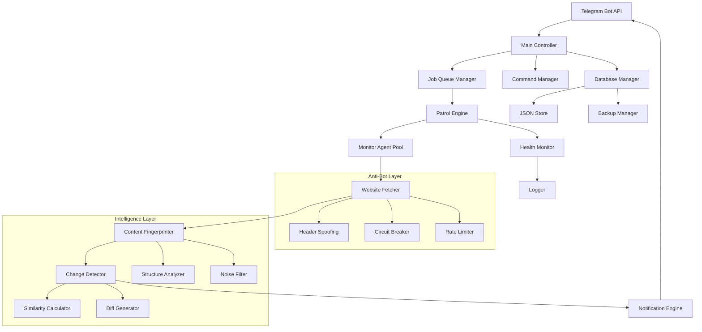
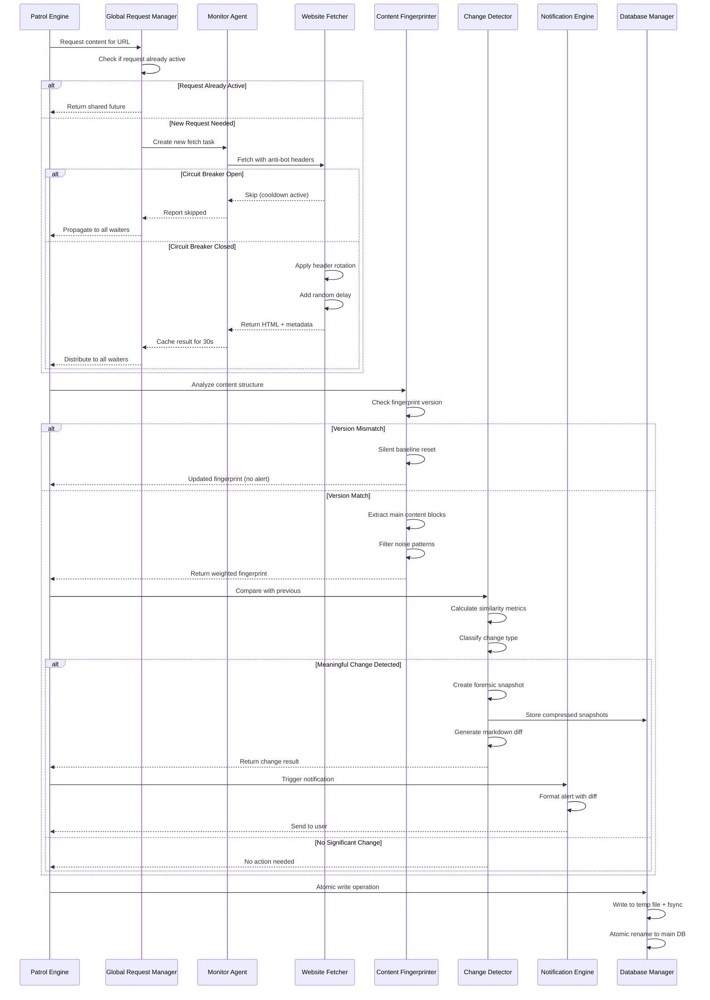

# Design Document

## Overview

WebDog Professional transforms from a basic monitoring tool into an enterprise-grade website change detection system. The architecture emphasizes modularity, resilience, and intelligent content analysis. The system implements advanced algorithms for noise filtering, anti-bot strategies, and real-time observability while maintaining the simplicity of the original Telegram interface.

## Architecture

### High-Level System Design



### Core Components

#### 1. Main Controller (main.py)
- **Role**: Central orchestrator and Telegram interface
- **Responsibilities**: Command routing, user session management, job scheduling
- **Key Features**: Inline keyboard management, error boundary handling, admin interface

#### 2. Patrol Engine (monitor.py)
- **Role**: Intelligent monitoring orchestration
- **Responsibilities**: Async job distribution, circuit breaker management, health tracking
- **Key Features**: Adaptive scheduling, load balancing, failure recovery

#### 3. Database Manager (database.py)
- **Role**: Data persistence and integrity with atomic guarantees
- **Responsibilities**: Write-Ahead Logging (WAL), atomic file swapping, schema versioning, backup management
- **Key Features**: Shadow paging, fsync operations, fingerprint versioning, compressed snapshots

## Components and Interfaces

### Monitor Agent Pool with Anti-Block Detection

```python
class MonitorAgent:
    """Individual monitoring agent with anti-bot capabilities and block-page detection"""
    
    # Common bot-blocking indicators
    BLOCK_PAGE_INDICATORS = [
        'cloudflare',
        'ddos-guard', 
        'captcha',
        'bot detection',
        'access denied',
        'blocked',
        'security check',
        'ray id',
        'cf-ray',
        'please verify you are human'
    ]
    
    async def fetch_with_resilience(self, url: str) -> FetchResult:
        """Implements circuit breaker pattern and header rotation with block detection"""
        
    async def analyze_content(self, html: str, previous_fingerprint: str) -> AnalysisResult:
        """Structure-aware content analysis with fingerprint versioning and block detection"""
        
        # Check for bot-blocking pages before processing
        if self._is_block_page(html):
            return AnalysisResult(
                blocked=True,
                fingerprint=None,
                error_type="BLOCK_PAGE_DETECTED",
                should_increment_failure=True
            )
            
        # Normal content analysis continues...
        
    def _is_block_page(self, html: str) -> bool:
        """Detect common bot-blocking pages to prevent false change alerts"""
        html_lower = html.lower()
        
        # Check for common blocking indicators
        for indicator in self.BLOCK_PAGE_INDICATORS:
            if indicator in html_lower:
                return True
                
        # Check for minimal content (likely a block page)
        text_content = BeautifulSoup(html, 'html.parser').get_text(strip=True)
        if len(text_content) < 100:  # Suspiciously short content
            return True
            
        # Check for common block page titles
        soup = BeautifulSoup(html, 'html.parser')
        title = soup.find('title')
        if title:
            title_text = title.get_text().lower()
            block_titles = ['access denied', 'blocked', 'security check', 'captcha']
            if any(block_title in title_text for block_title in block_titles):
                return True
                
        return False
        
    def calculate_similarity(self, old_content: str, new_content: str) -> SimilarityMetrics:
        """Multi-algorithm similarity calculation (Jaccard + Levenshtein)"""
        
    async def get_or_create_global_fetch(self, normalized_url: str) -> SharedFetchResult:
        """Request collapsing: single fetch shared across multiple users"""
```

### Database Manager with Atomic Persistence, Concurrency Safety, and Storage Guards

```python
class AtomicDatabaseManager:
    """Enterprise-grade database operations with atomic guarantees, concurrency safety, and storage validation"""
    
    def __init__(self):
        self.write_queue = asyncio.Queue()
        self.write_worker_task = None
        self.MIN_FREE_SPACE_MB = 100  # Minimum free space required
        self._start_write_worker()
    
    def _start_write_worker(self):
        """Single-worker write queue to prevent race conditions"""
        self.write_worker_task = asyncio.create_task(self._write_worker())
    
    async def _write_worker(self):
        """Single worker processes all writes sequentially"""
        while True:
            write_operation = await self.write_queue.get()
            try:
                await self._perform_atomic_write(write_operation)
            except Exception as e:
                write_operation.future.set_exception(e)
            else:
                write_operation.future.set_result(True)
            finally:
                self.write_queue.task_done()
    
    async def atomic_write(self, data: dict) -> bool:
        """Queue write operation with pre-flight storage validation"""
        # Pre-flight disk space check
        if not self._check_disk_space():
            raise InsufficientStorageError(f"Less than {self.MIN_FREE_SPACE_MB}MB free space available")
            
        future = asyncio.Future()
        write_op = WriteOperation(data=data, future=future)
        await self.write_queue.put(write_op)
        return await future
        
    def _check_disk_space(self) -> bool:
        """Verify sufficient disk space before write operations"""
        try:
            stat = os.statvfs(os.path.dirname(self.db_path))
            free_space_mb = (stat.f_bavail * stat.f_frsize) / (1024 * 1024)
            return free_space_mb >= self.MIN_FREE_SPACE_MB
        except Exception:
            # If we can't check, assume we have space (fail open)
            return True
        
    async def _perform_atomic_write(self, write_op: WriteOperation) -> bool:
        """Write-Ahead Logging with atomic file swapping and UTC timestamps"""
        # Create rolling backup before any write
        await self._create_rolling_backup()
        
        # Ensure all timestamps are in ISO 8601 UTC format
        normalized_data = self._normalize_timestamps(write_op.data)
        
        temp_file = f"{self.db_path}.tmp"
        
        # Write to temporary file
        with open(temp_file, 'w') as f:
            json.dump(normalized_data, f, indent=4)
            f.flush()
            os.fsync(f.fileno())  # Force physical write to disk
        
        # Atomic rename (guaranteed atomic on POSIX systems)
        os.rename(temp_file, self.db_path)
        
    def _normalize_timestamps(self, data: dict) -> dict:
        """Ensure all timestamps are in ISO 8601 UTC format for clock resilience"""
        def normalize_recursive(obj):
            if isinstance(obj, dict):
                result = {}
                for key, value in obj.items():
                    if key.endswith('_at') or key.endswith('_time') or key == 'timestamp':
                        # Ensure timestamp is in ISO 8601 UTC format
                        if isinstance(value, str):
                            try:
                                dt = datetime.fromisoformat(value.replace('Z', '+00:00'))
                                result[key] = dt.astimezone(timezone.utc).isoformat().replace('+00:00', 'Z')
                            except ValueError:
                                # If parsing fails, use current UTC time
                                result[key] = datetime.utcnow().isoformat() + 'Z'
                        else:
                            result[key] = datetime.utcnow().isoformat() + 'Z'
                    else:
                        result[key] = normalize_recursive(value)
                return result
            elif isinstance(obj, list):
                return [normalize_recursive(item) for item in obj]
            else:
                return obj
        
        return normalize_recursive(data)
    
    async def _create_rolling_backup(self):
        """Create timestamped backup before schema migrations"""
        if os.path.exists(self.db_path):
            timestamp = datetime.utcnow().strftime("%Y%m%d_%H%M%S")
            backup_path = f"{self.db_path}.backup_{timestamp}"
            shutil.copy2(self.db_path, backup_path)
            
            # Keep only last 5 backups
            self._cleanup_old_backups()
    
    def migrate_fingerprint_versions(self, fingerprint: dict) -> dict:
        """Handle fingerprint version migrations without false alerts"""
        if fingerprint.get('version', 'v1.0') != self.current_version:
            return self.silent_baseline_reset(fingerprint)
        return fingerprint
        
    def store_forensic_snapshot(self, url: str, content: str, change_data: dict):
        """Store compressed content snapshots for dispute resolution"""
        compressed = zlib.compress(content.encode('utf-8'))
        snapshot = {
            "timestamp": datetime.utcnow().isoformat() + 'Z',  # UTC ISO 8601
            "compressed_content": base64.b64encode(compressed).decode('ascii'),
            **change_data
        }
        return snapshot

class JobBasedDataLoader:
    """Memory-optimized data loading for large-scale operations"""
    
    def __init__(self, db_manager: AtomicDatabaseManager):
        self.db_manager = db_manager
        self.metadata_cache = {}  # Lightweight cache for job scheduling
        
    async def load_job_metadata(self) -> Dict[str, JobMetadata]:
        """Load only metadata needed for job scheduling"""
        full_data = await self.db_manager.load_all_monitors()
        
        metadata = {}
        for chat_id, user_data in full_data.items():
            monitors = user_data.get('monitors', [])
            metadata[chat_id] = JobMetadata(
                monitor_count=len(monitors),
                urls=[m['url'] for m in monitors],
                last_check_times=[m['metadata']['last_check'] for m in monitors],
                circuit_breaker_states=[m['metadata']['circuit_breaker_state'] for m in monitors]
            )
        
        return metadata
    
    async def load_full_user_config(self, chat_id: str) -> UserConfig:
        """Load complete user configuration only when needed"""
        full_data = await self.db_manager.load_all_monitors()
        return full_data.get(chat_id, {})
```

### Request Collapsing Engine with Hard Timeouts

```python
class GlobalRequestManager:
    """Implements request de-duplication with resource leak prevention"""
    
    def __init__(self):
        self.active_requests = {}  # normalized_url -> Future
        self.request_cache = {}    # normalized_url -> (result, timestamp)
        self.HARD_TIMEOUT = 15     # Strict 15-second timeout
        
    async def get_shared_content(self, url: str) -> FetchResult:
        """Single fetch shared across multiple monitoring requests with hard timeout"""
        normalized_url = self.normalize_url(url)
        
        # Check if request is already in progress
        if normalized_url in self.active_requests:
            return await self.active_requests[normalized_url]
            
        # Check cache (valid for 30 seconds to handle near-simultaneous requests)
        cached = self.request_cache.get(normalized_url)
        if cached and (time.time() - cached[1]) < 30:
            return cached[0]
            
        # Create new shared request with hard timeout
        fetch_task = asyncio.create_task(self._fetch_content(url))
        timeout_task = asyncio.wait_for(fetch_task, timeout=self.HARD_TIMEOUT)
        self.active_requests[normalized_url] = timeout_task
        
        try:
            result = await timeout_task
            self.request_cache[normalized_url] = (result, time.time())
            return result
        except asyncio.TimeoutError:
            # Prevent zombie processes
            fetch_task.cancel()
            raise FetchTimeoutError(f"Request to {url} exceeded {self.HARD_TIMEOUT}s timeout")
        finally:
            self.active_requests.pop(normalized_url, None)
            
    def normalize_url(self, url: str) -> str:
        """Create consistent URL identifier for de-duplication"""
        parsed = urlparse(url.lower())
        # Remove common tracking parameters
        query_params = parse_qs(parsed.query)
        filtered_params = {k: v for k, v in query_params.items() 
                          if k not in ['utm_source', 'utm_medium', 'fbclid', 'gclid']}
        
        normalized_query = urlencode(sorted(filtered_params.items()))
        return urlunparse((parsed.scheme, parsed.netloc, parsed.path, 
                          parsed.params, normalized_query, ''))
```

### Content Fingerprinter with Versioning

```python
class VersionedContentFingerprinter:
    """Advanced content analysis with algorithm versioning"""
    
    VERSION = "v2.0"
    
    def extract_main_content(self, soup: BeautifulSoup) -> str:
        """Structure-aware extraction prioritizing main content blocks"""
        
    def filter_noise(self, content: str) -> str:
        """Remove timestamps, session IDs, and dynamic elements"""
        
    def generate_weighted_fingerprint(self, content: str) -> WeightedFingerprint:
        """Create versioned fingerprint with content importance weights"""
        fingerprint = {
            "hash": self._calculate_hash(content),
            "version": self.VERSION,
            "algorithm": "weighted_semantic",
            "content_weights": self._calculate_weights(content),
            "structure_signature": self._extract_structure(content)
        }
        return fingerprint
        
    def handle_version_migration(self, old_fingerprint: dict, current_content: str) -> dict:
        """Migrate old fingerprint versions without triggering false alerts"""
        if old_fingerprint.get('version') != self.VERSION:
            # Silent baseline reset - update fingerprint without alerting
            return self.generate_weighted_fingerprint(current_content)
        return old_fingerprint
```

### Change Detector with Forensic Capabilities and Telegram Safety

```python
class ForensicChangeDetector:
    """Intelligent change detection with forensic snapshots and Telegram payload safety"""
    
    MAX_TELEGRAM_DIFF_LENGTH = 3000  # Telegram message limit safety
    
    def detect_meaningful_change(self, old_fp: WeightedFingerprint, new_fp: WeightedFingerprint) -> ChangeResult:
        """Multi-algorithm change detection with configurable thresholds"""
        
    def generate_safe_diff(self, old_content: str, new_content: str) -> SafeMarkdownDiff:
        """Generate visual markdown diff with Telegram payload safety"""
        full_diff = self._generate_full_diff(old_content, new_content)
        
        if len(full_diff) <= self.MAX_TELEGRAM_DIFF_LENGTH:
            return SafeMarkdownDiff(
                content=full_diff,
                truncated=False,
                full_length=len(full_diff)
            )
        
        # Truncate and provide summary
        truncated_diff = full_diff[:self.MAX_TELEGRAM_DIFF_LENGTH - 200]
        summary = self._generate_diff_summary(old_content, new_content)
        
        safe_diff = f"{truncated_diff}\n\n⚠️ **Diff truncated** ({len(full_diff)} chars total)\n{summary}"
        
        return SafeMarkdownDiff(
            content=safe_diff,
            truncated=True,
            full_length=len(full_diff),
            summary=summary
        )
        
    def _generate_diff_summary(self, old_content: str, new_content: str) -> str:
        """Generate concise summary for truncated diffs"""
        old_lines = old_content.split('\n')
        new_lines = new_content.split('\n')
        
        added_lines = len(new_lines) - len(old_lines)
        if added_lines > 0:
            return f"📈 +{added_lines} lines added"
        elif added_lines < 0:
            return f"📉 {abs(added_lines)} lines removed"
        else:
            return f"🔄 {len(old_lines)} lines modified"
        
    def classify_change_type(self, similarity_metrics: SimilarityMetrics) -> ChangeType:
        """Classify as UI_TWEAK, CONTENT_UPDATE, or MAJOR_OVERHAUL"""
        
    def create_forensic_snapshot(self, url: str, old_content: str, new_content: str, change_result: ChangeResult) -> ForensicSnapshot:
        """Store compressed snapshots for dispute resolution and replay analysis"""
        compressed_old = zlib.compress(old_content.encode('utf-8'))
        compressed_new = zlib.compress(new_content.encode('utf-8'))
        
        return ForensicSnapshot(
            timestamp=datetime.utcnow().isoformat(),
            url=url,
            old_content_compressed=base64.b64encode(compressed_old).decode('ascii'),
            new_content_compressed=base64.b64encode(compressed_new).decode('ascii'),
            change_type=change_result.change_type,
            similarity_metrics=change_result.similarity_metrics,
            diff_summary=change_result.diff_summary,
            diff_truncated=change_result.safe_diff.truncated
        )
        
    def replay_change_detection(self, snapshot: ForensicSnapshot) -> ReplayResult:
        """Forensic replay for dispute resolution - decompress and re-analyze"""
        old_content = zlib.decompress(base64.b64decode(snapshot.old_content_compressed)).decode('utf-8')
        new_content = zlib.decompress(base64.b64decode(snapshot.new_content_compressed)).decode('utf-8')
        
        # Re-run analysis with current algorithms
        return self.detect_meaningful_change(old_content, new_content)
```

## Data Models

### Enhanced Monitor Schema

```json
{
  "schema_version": "2.0",
  "chat_id": {
    "user_config": {
      "similarity_threshold": 0.85,
      "check_interval": 60,
      "notification_preferences": {
        "include_diff": true,
        "max_diff_length": 500,
        "alert_types": ["CONTENT_UPDATE", "MAJOR_OVERHAUL"]
      }
    },
    "monitors": [
      {
        "url": "https://example.com",
        "fingerprint": {
          "hash": "abc123",
          "version": "v2.0",
          "algorithm": "weighted_semantic",
          "content_weights": {"main": 0.8, "sidebar": 0.2},
          "structure_signature": "div.main>article>p*5"
        },
        "metadata": {
          "created_at": "2024-01-01T00:00:00Z",
          "last_check": "2024-01-01T12:00:00Z",
          "check_count": 1440,
          "failure_count": 0,
          "circuit_breaker_state": "CLOSED",
          "snooze_until": null,
          "global_request_id": "sha256_of_normalized_url"
        },
        "forensic_snapshots": [
          {
            "timestamp": "2024-01-01T11:30:00Z",
            "compressed_content": "eJy1kMsKwjAQRX+lzLqF5tE0...",
            "change_type": "CONTENT_UPDATE",
            "similarity_score": 0.75,
            "diff_summary": "Added 2 paragraphs in main content"
          }
        ],
        "history": [
          {
            "timestamp": "2024-01-01T11:30:00Z",
            "change_type": "CONTENT_UPDATE",
            "similarity_score": 0.75,
            "diff_summary": "Added 2 paragraphs in main content"
          }
        ]
      }
    ]
  }
}
```

### Health Metrics Schema

```json
{
  "system_health": {
    "timestamp": "2024-01-01T12:00:00Z",
    "metrics": {
      "active_monitors": 1250,
      "avg_response_time_ms": 850,
      "success_rate_24h": 0.987,
      "worker_saturation": 0.65,
      "circuit_breakers_open": 3,
      "rate_limit_hits": 12
    },
    "per_user_stats": {
      "123456": {
        "monitors_count": 15,
        "avg_check_interval": 45,
        "failure_rate": 0.02
      }
    }
  }
}
```

## Algorithm Design

### Enhanced Smart Sniffing Workflow with Request Collapsing



### Structure-Aware Content Extraction

```python
def extract_main_content(self, soup: BeautifulSoup) -> WeightedContent:
    """
    Implements intelligent content prioritization:
    1. Identify main content containers (article, main, .content)
    2. Score elements by semantic importance
    3. Filter out navigation, ads, and dynamic elements
    4. Return weighted content blocks
    """
    
    # Content scoring weights
    SEMANTIC_WEIGHTS = {
        'article': 1.0,
        'main': 0.9,
        'h1, h2, h3': 0.8,
        'p': 0.7,
        'div.content': 0.8,
        'aside': 0.3,
        'nav': 0.1,
        'footer': 0.1
    }
    
    # Noise patterns to exclude
    NOISE_PATTERNS = [
        r'\d{4}-\d{2}-\d{2}',  # Dates
        r'Session ID: \w+',     # Session identifiers
        r'Last updated: .*',    # Update timestamps
        r'Advertisement',       # Ad content
        r'Cookie notice'        # Cookie banners
    ]
```

### Multi-Algorithm Similarity Detection

```python
def calculate_comprehensive_similarity(self, old_content: str, new_content: str) -> SimilarityMetrics:
    """
    Implements multiple similarity algorithms for robust change detection:
    
    1. Jaccard Index: Set-based similarity for word overlap
    2. Levenshtein Distance: Character-level edit distance
    3. Semantic Similarity: Content structure comparison
    4. Weighted Scoring: Importance-based final score
    """
    
    # Jaccard similarity (word-level)
    old_words = set(old_content.lower().split())
    new_words = set(new_content.lower().split())
    jaccard_score = len(old_words & new_words) / len(old_words | new_words)
    
    # Levenshtein ratio (character-level)
    levenshtein_ratio = difflib.SequenceMatcher(None, old_content, new_content).ratio()
    
    # Semantic structure similarity
    semantic_score = self.compare_content_structure(old_content, new_content)
    
    # Weighted final score
    final_score = (jaccard_score * 0.4 + levenshtein_ratio * 0.4 + semantic_score * 0.2)
    
    return SimilarityMetrics(
        jaccard=jaccard_score,
        levenshtein=levenshtein_ratio,
        semantic=semantic_score,
        final=final_score
    )
```

## Error Handling

### Circuit Breaker Implementation

```python
class CircuitBreaker:
    """Implements circuit breaker pattern for resilient web fetching"""
    
    def __init__(self, failure_threshold=3, recovery_timeout=3600):
        self.failure_threshold = failure_threshold
        self.recovery_timeout = recovery_timeout
        self.failure_count = 0
        self.last_failure_time = None
        self.state = "CLOSED"  # CLOSED, OPEN, HALF_OPEN
    
    async def call(self, func, *args, **kwargs):
        if self.state == "OPEN":
            if time.time() - self.last_failure_time > self.recovery_timeout:
                self.state = "HALF_OPEN"
            else:
                raise CircuitBreakerOpenError("Circuit breaker is open")
        
        try:
            result = await func(*args, **kwargs)
            self.on_success()
            return result
        except Exception as e:
            self.on_failure()
            raise e
```

### Structured Error Logging

```python
class StructuredLogger:
    """JSON-formatted logging with correlation IDs"""
    
    def log_error(self, error: Exception, context: dict):
        log_entry = {
            "timestamp": datetime.utcnow().isoformat(),
            "level": "ERROR",
            "correlation_id": context.get("chat_id"),
            "component": context.get("component"),
            "url": context.get("url"),
            "error_type": type(error).__name__,
            "error_message": str(error),
            "stack_trace": traceback.format_exc(),
            "system_metrics": self.get_current_metrics()
        }
        
        logger.error(json.dumps(log_entry))
```

## Testing Strategy

### Unit Testing Approach

1. **Component Isolation**: Each module tested independently with mocked dependencies
2. **Algorithm Validation**: Comprehensive test cases for similarity algorithms with known inputs/outputs
3. **Error Simulation**: Circuit breaker and retry logic tested with simulated failures
4. **Performance Testing**: Load testing with concurrent monitoring jobs

### Integration Testing

1. **End-to-End Workflows**: Complete monitoring cycles from URL addition to change notification
2. **Database Integrity**: Concurrent write operations and data consistency validation
3. **Telegram Integration**: Bot command handling and inline keyboard interactions
4. **Anti-Bot Effectiveness**: Header rotation and circuit breaker behavior validation

### Test Data Strategy

```python
# Test fixtures for algorithm validation
SIMILARITY_TEST_CASES = [
    {
        "old_content": "The quick brown fox jumps over the lazy dog",
        "new_content": "The quick brown fox leaps over the lazy dog",
        "expected_jaccard": 0.89,
        "expected_levenshtein": 0.95,
        "expected_classification": "UI_TWEAK"
    },
    {
        "old_content": "Original article about technology trends",
        "new_content": "Completely different article about cooking recipes",
        "expected_jaccard": 0.1,
        "expected_levenshtein": 0.2,
        "expected_classification": "MAJOR_OVERHAUL"
    }
]
```

This design provides a robust foundation for transforming WebDog into a professional-grade monitoring system with advanced intelligence, resilience, and observability features.